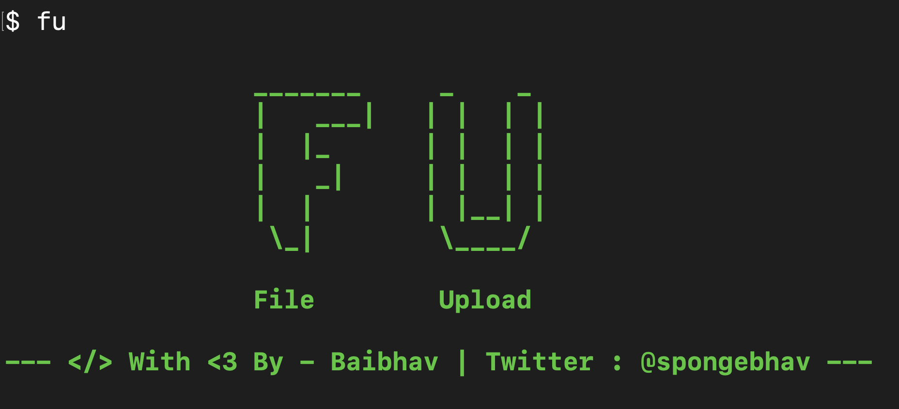

<h1 align="left" style="font-size:36px;font-weight:bold;">
        FU - File Upload 
</h1>

<h4 align="left">
  <strong> Coded with ❤️ by Baibhav. (<a href='https://twitter.com/spongebhav' target="_blank">@spongebhav</a>)</strong>
</h4>

<h2 align="left">
  <strong>About FU</strong>
 </h2>
 

**FU** stands for File Upload. It is a command line tool written in Bash. It allows you to easily upload files temporarily and share it with other people with ease in comfort of your terminal. You can also set custom expiry date for the files. 

**It is powered by file.io**

<h2 align="left">
  <strong>Installation</strong>
</h2>

**For Linux Users AND Intel Based MAC USERS**

FOR non apt linux users please download and jq manually from : https://stedolan.github.io/jq/download/

 * Download OR Clone the repository in your machine:
<pre>git clone https://github.com/baibhavanand/fileupload</pre>

* Switch to **fu** directory:
<pre>cd fu</pre>

* Give permissions to install.sh file:
<pre>sudo chmod 777 install.sh</pre>

* Run install.sh:
<pre>sudo ./install.sh --install</pre>

**For M1 based Mac Users**

* Download this JQ binary file from here: https://github.com/stedolan/jq/releases/download/jq-1.6/jq-osx-amd64

* Go To **Downloads** directory:
<pre>cd Downloads</pre>

* Rename jq-osx-amd64 to jq
<pre>mv jq-osx-amd64 jq</pre>

* Move copy to /usr/local/bin
<pre>cp jq /usr/local/bin</pre>

* Type jq in terminal
<pre>jq</pre>

* Click Close
* Go to Settings > System Preferences > Security and Privacy > General
* Click on open anyway
* In termninal type JQ again and click on open anyway

* Enter cd
<pre>cd</pre>

* Download OR Clone the repository in your machine:
<pre>git clone https://github.com/baibhavanand/fileupload</pre>

* Go to **file upload** directory
<pre>cd file upload</pre>

* Give permissions to fu
<pre>sudo chmod 777 fu</pre>

* Copy **fu** to /usr/local/bin
<pre>sudo cp fu /usr/local/bin</pre>

<h2 align="left">
  <strong>Usage</strong>
 </h2>
 
   Arguments    | Description
------------- |-------------
-f            | To specify file name or file path
-t            | To specify your content that you want to upload as text file
-e            | To specify expiry date (optional)

<h2 align="left">
  <strong>Examples</strong>
</h2>
 
* Simple File Upload
 <pre>fu -f filename/filepath</pre>
 
 This will simply upload the file with 14 days expiry time and give you the link.
 
 
 * Uploading a text as text file.
 <pre>fu -t 'your text here'</pre>
 
This will upload text.txt file containing *your text here* and will give you a link.
 
 
* Set an Expiry date to your file
 <pre>fu -t 'your text here' -e 1d/w/m/y</pre>
 
 This will set the expiry date of the file according to the specified time.
 
 
 <h2 align="left">
  <strong>LICENSE</strong>
 </h2>
 
**File Upload** is licensed under the **MIT license.** Take a look at the [LICENSE](https://github.com/baibhavanand/fileupload/blob/main/LICENSE) for more information.

 <h2 align="center">
  <strong>Pull Requests</strong>
 </h2>

    

<strong>Pull Requests</strong> for any kind of improvement in **FU** are welcome.

 

<i>This project is maintained by <a href="https://github.com/baibhavanand">Baibhav Anand Jha</a> | Twitter: <a href="https://twitter.com/spongebhav">@spongebhav</a></i>
